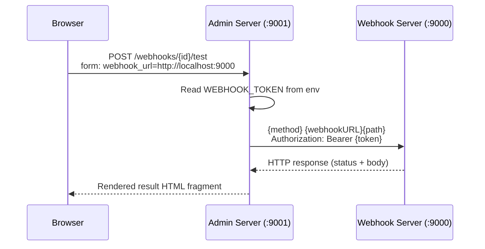

# Add Webhook Test Section to Admin Dashboard

## Approach

Add a server-side proxy endpoint (`POST /webhooks/{id}/test`) to the admin server. When the user clicks "Test", the admin server makes an HTTP request to the webhook server on their behalf, injecting the `Authorization: Bearer <WEBHOOK_TOKEN>` header. The token comes from the environment (`.env`), while the webhook server URL is typed directly in the UI form — since it's not a secret and may vary.

## Changes

### 1. Update admin server to accept webhook token

- In [cmd/admin/main.go](cmd/admin/main.go), read `WEBHOOK_TOKEN` from `os.Getenv` (not fatal if empty — testing simply won't work without it)
- Pass it to `admin.NewServer(database, logsDir, webhookToken)`

### 2. Add the test handler in the admin server

- In [internal/admin/server.go](internal/admin/server.go):
  - Add `webhookToken` field to the `Server` struct
  - Update `NewServer` signature to accept and store it
  - Register route: `POST /webhooks/{id}/test`
  - Implement `handleTestWebhook`:
    1. Read `webhook_url` from the form (e.g. `http://localhost:9000`)
    2. Read optional `body` from the form
    3. Look up the webhook by ID from the DB
    4. Build the target URL: `webhookURL + webhook.Path`
    5. Create an `http.Request` with `webhook.HttpMethod`, the provided body, and `Authorization: Bearer <token>` header
    6. Execute via `http.Client` (with a reasonable timeout, e.g. 10s)
    7. Render the result (status code, response body) as an HTML fragment via a new templ component

### 3. Add the UI template

- In [internal/admin/templates/index.templ](internal/admin/templates/index.templ):
  - Add a new "Test Webhook" section below the existing sections, containing a form with:
    - A text input for **Webhook Server URL** (placeholder `http://localhost:9000`)
    - A `<select>` dropdown populated with all configured webhooks (shows method + path)
    - An optional `<textarea>` for a custom request body
    - A "Test" button — uses JS to dynamically set the HTMX post URL to `/webhooks/{selectedId}/test`, targeting a `#test-result` div
    - A `#test-result` div that shows the response
  - Add a `TestResult` templ component that displays:
    - HTTP status code (color-coded: green for 2xx, red otherwise)
    - Response body in a `<pre>` block

### 4. Run templ generate

- Run `templ generate` to regenerate `*_templ.go` files from the updated `.templ` files

## Design decisions

- **Server-side proxy over client-side fetch**: The token stays on the server and is never sent to the browser. This matches the security model of the existing webhook server.
- **URL in UI, token in env**: The webhook server URL is not sensitive and may change between environments, so a UI field is more convenient. The bearer token is a secret and belongs in the environment.
- **HTMX pattern**: Matches the existing UI conventions (htmx partial swaps, Tailwind styling, templ components).
